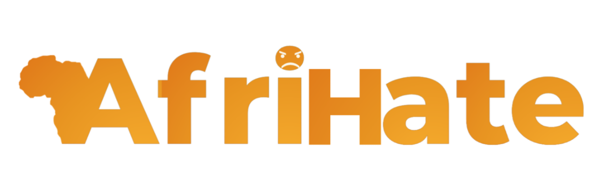
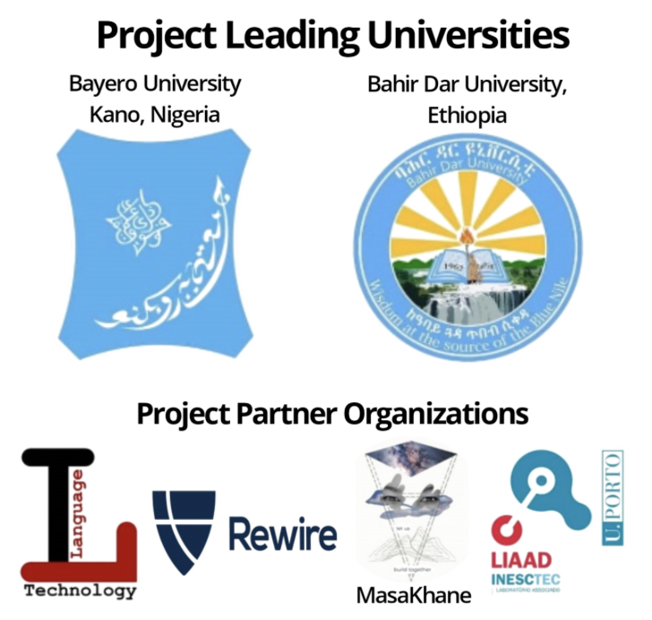

  

> “No one is born hating another person because of the colour of his skin, or his background, or his religion. People must learn to hate, and if they can learn to hate, they can be taught to love, for love comes more naturally to the human heart than its opposite.” —-Nelson Mandela, Long Walk to Freedom 

  <h1 align="center">Hate and Offensive Speech Detection Dataset for African Languages</h1>

<!-- Badges -->

  

  

   

  

# Project Description

 

Online hate is a growing problem across Africa. It inflicts harm on the people exposed to and targeted by it, pollutes and disrupts online communities and, in the worst cases, can be a precursor to physical violence. Machine learning tools for automatically finding and rating the hatefulness of online content can help to address this problem, supporting content moderation efforts, social media monitoring, and threat evaluation.

However, at present, there are almost no hate detection tools available for any African languages, either in academia or industry. This means that African users of online services are more likely to not be protected against hate or to unfairly have their content moderated,  which can severely restrict free expression and open use of the Internet.

Our project addresses this problem by introducing AfriHate, the first labelled dataset for online hate in Africa, covering X languages. We are also creating baseline machine learning models for each language, which will be made available to other researchers, civil society organisations and social media platforms to use. This is a first-of-its-kind project which has the potential to transform how online hate is understood, tackled and researched across Africa.

# Languages and Coordinators
----------------
| Language | Volunteer names |
|----------|-----------------|
| Hausa  |   |
| Yoruba  | |
| Igbo  |  |
| Nigerian-Pidgin |  |
| Swahili  |   |
|    | |
|  |   |
| |   |
|   |
|  |  |

# Team 

This is a collaborative project with team members from different universities, institutions, and industries. 

# Funding

This project is funded [Lacuna Fund](https://lacunafund.org)
