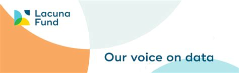
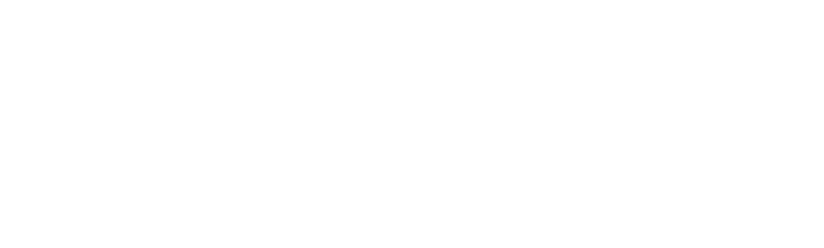

  

> “No one is born hating another person because of the colour of his skin, or his background, or his religion. People must learn to hate, and if they can learn to hate, they can be taught to love, for love comes more naturally to the human heart than its opposite.” — Nelson Mandela, Long Walk to Freedom 

  <h1 align="center">Hate and Offensive Speech Detection Dataset for African Languages</h1>

<!-- Badges -->

  
  

  

  

   

  

   

# Project Description

 

Online hate is a growing problem worldwide, causing harm to users who are exposed to it, polluting and disrupting online communities, and leading to psychological harm and offline violence. Social media platforms facilitate the propagation of hate and offensive speech by allowing users to rapidly create and spread hateful content.

Social media organizations have taken various steps to protect their platforms from the spread of hate speech including in Africa.
However, efforts to address hateful content have primarily focused on high-profile individuals, and are addressed through time-intensive human-based review. This approach is not scalable and fails to effectively moderate the vast majority of content produced by less prominent individuals. A significant obstacle to improving moderation is that African languages are 'low-resource', and automated assistive machine learning tools are not yet available. As a result, African languages remain under-served and African users are subject to restrictive interventions such as the removal of content based on certain keywords, regardless of context or intent.

Our project <b>AfriHate</b>, introcues the first collection of high-quality labeled Twitter datasets for detecting hate and abusive languages in 18 African languages. We will share data and baseline machine learning detection models for each language to enable further research, understanding, and analysis of online hate across Africa.

# Languages and Coordinators
----------------
| # | Language | Country | Language Coordinators|
|----------|-----------|----------|-----------------|
| 1. | Hausa | Nigeria | |
| 2. | Yoruba | Nigeria | |
| 3. | Igbo | Nigeria | |
| 4. | Nigerian-Pidgin | Nigeria | |
| 5. | Amharic | Ethiopia | |
| 6. | Tigrinya | Ethiopia | |
| 7. | Oromo | Ethiopia |  |
| 8. | Somali | Ethiopia |  |
| 9. | Twi | Ghana | |
| 10. | Swahili | Kenya | |
| 11. | Moroccan Arabic | Morocco |  |
| 12. | Mozambican Portuguese | Mozambique |  |
| 13. | Kinyarwanda | Rwanda |  |
| 14. | isiZulu | South Africa | |
| 15. | Afrikaans | South Africa | |
| 16. | isiXhosa | South Africa |  |
| 17. | Sudanese Arabic | Sudan |  |
| 18. | Algerian Arabic | Algeria |  |

# Team 

This is a collaborative project with team members from different universities, institutions, and the industry. Team members include:

----------------

| Name | Aflliation|
|----------|-----------------|
| Shamsudden Muhammad  | Bayero University, Kano; MasaKhane |
| Seid Muhie Yimam  | University of Humberg |
| Idris Abdulmumin  | Ahmadu Bello University, Zaria |
| Ibrahim Sa’id Ahmad  |  Bayero University, Kano; MasaKhane |
| Abinew Ali |  Bahir Dar University |
|Bertie Vidgen| Rewire|
| David Ifeoluwa Adelani | MasaKhane; Saarland University   |
|Sebastian Ruder    | Senior Research Scientist, Google|
| Monojit Choudhury |  Senior Researcher, Microsoft |
| Saminu Aliyu  | Bayero University, Kano; MasaKhane |
| Nedjma Ousidhoum | University of Cambridge|
| Debora Nozza |Bocconi University, Italy |
| Paul Röttger | Rewire, University of Oxford|

# Funding

This project is funded by [Lacuna Fund](https://lacunafund.org) and received cloud credits and computational resources support from [Oracle for Research](https://www.oracle.com/research/).

